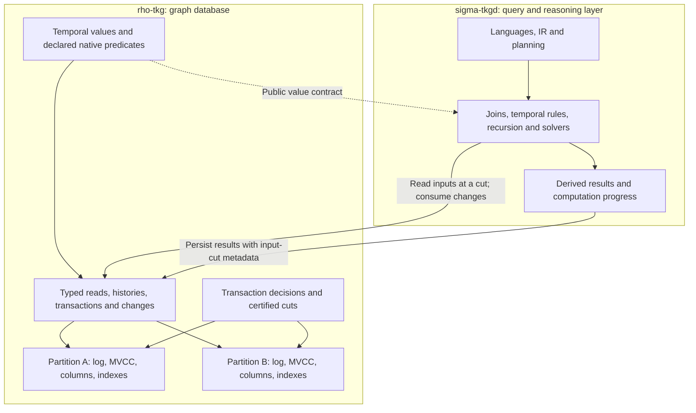

# Temporal storage for rho-tkg v5

Proposal, 2026-10-09. **rho-tkg is the graph database; sigma-tkgd is the reasoning
layer.** The aim is to preserve the temporal information many kinds of reasoning
need, expose it efficiently, and maintain its database meaning across machines.

The recommendation is **typed temporal graph data, compact layouts selected by
profile, exact native access, and distributed transactions**. Sigma owns query
planning, joins, temporal operators, recursion and solvers. Their interface must
carry enough information for correct reasoning without imposing one time model.

## What the database must represent

Graph records describe occurrences, enduring states, changes, relationships,
observations, constraints and derived knowledge. These may have exact coordinates,
unknown placement, separated periods, repeated schedules or only ordering
relationships. Identities and retained histories must survive corrections.

| Concern | Meaning |
|---|---|
| Identity and assertion | Which object, occurrence or claim is this? |
| Domain and order | Which positions exist, and which are before, equal or incomparable? |
| Axis and role | Which reference system is used, and what does this time association mean? |
| Scope | Point, span, region or a symbolic description of placement |
| Duration and metric | Which elapsed-amount, translation or distance operations have meaning? |
| Knowledge | How precise, certain or incomplete is the placement? |
| Interpretation | Occurrence, persistent state, observation or derived statement |
| Granularity | Which distinctions are retained, grouped or discarded? |
| Representation and access | How are values encoded, compressed, stored and indexed? |

These concepts have dependencies: a linear interval needs an appropriate order;
a duration does not automatically define a metric; a calendar shift needs
calendar rules. A profile names those contracts. Density always has a subject:
an order-dense domain can have sparse observations stored in dense arrays.
Integer endpoint encoding need not make the semantic domain discrete. Graph
topology, order topology and database indexes are different concepts.

## Architecture and ownership

Nodes, relationships and properties remain the graph model. Their component
histories carry temporal scope and knowledge; temporal properties remain values
unless explicitly used as a component's scope. Common points and spans have
specialized storage. Structured coordinates, correlation references and symbolic
descriptors pay for their additional representation only when present.

Each profile declares three separate support levels: **lossless preservation**,
**native database predicates**, and **evaluation in sigma**. Preserving a recurrence
does not mean rho expands it; preserving causal edges does not mean it computes
their transitive consequences. Rho may perform exact overlap, containment,
endpoint comparison and region subtraction for native reads and state corrections.
Sigma owns temporal joins, inference and completion of computations.

Rho's batches avoid materializing full graph objects when sigma needs selected
columns. Its snapshot-to-change-feed handoff is gap-free, changes retain complete
transaction boundaries, and corrections include before/after information.
Sigma converts those changes into its own computational deltas. Source
completeness, database visibility and reasoning completion remain separate.

## Worked examples

**Point, state and identity.** Two logins at 12 remain two events. “Session active
on [12,20)” describes a state. A login or temperature observation at 12 does not
establish persistence afterward. Rho preserves these distinctions; sigma can
derive persistence under an explicit rule.

**Encoding versus domain.** Bounds 0 and 1 denote an empty open interval over
integers and a nonempty one over rationals. Over integers, [0,1) and Point(0)
have equal support; over rationals they differ. If sigma derives 1/3, rho must
retain and compare it exactly even when common values use int64 columns.
The distinction also affects range canonicalization in
[PostgreSQL](https://www.postgresql.org/docs/18/rangetypes.html#RANGETYPES-DISCRETE).

**Nearby numbers and uncertain knowledge.** 11.9999999 and 12.0000001 seconds
differ by 200 ns. Explicit rounding to the nearest microsecond produces equal
derived coordinates, not equal event identities. An event with hard possible
support U=[11.9,12.1] possibly lies in [12,13), but definitely lies in [11,13).
It did not occur continuously throughout U. If A=10+x and B=11+x share one
unknown clock offset, sigma can infer B-A=1 exactly. Rho must preserve the shared
constraint instead of replacing it with independent error bars. Numerical error,
measurement uncertainty and matching tolerance have different contracts.

**Order without elapsed time.** A precedes C and B precedes C leaves A versus B
undetermined. Rho's enumeration order cannot become an asserted causal fact.
For model coordinates (12,0) and (12,1), lexicographic order differs while elapsed
model time is zero. A paused business clock can likewise assign zero elapsed
amount to distinct positions. Neither case requires an invented smaller unit.

**Reasoning over corrected history.** P holds on [0,4), Q on [2,6). Sigma computes
their conjunction on [2,4). Rho returns the source histories at the requested
cut, reports later corrections atomically and can persist sigma's derived result
with its input cut. For recursive reachability, sigma must distinguish removal
of one supporting path from removal of the last. That dependency maintenance
belongs in sigma; [DBSP](https://mihaibudiu.github.io/work/budiu-vldb23.pdf) is
relevant research for its incremental execution.

**A distributed graph change.** One transaction changes a node on partition A
and a life-bound edge on B. A has applied it while B is delayed. Rho must resolve
or wait, or return an explicitly older certified snapshot. It cannot present the
new node and old edge as one complete cut. “Largest commit number observed” is
insufficient if an older eligible transaction remains unresolved.

**Recurrence and large gaps.** Months without observed events require no
materialized ticks or changing metric. Rho can retain “every weekday at 09:00”
with calendar version and exceptions; sigma expands or reasons over it. A weekly
summary cannot answer every millisecond-scale question. Some temporal rule
systems require periodic or automata representations instead of endless interval
materialization, as illustrated by
[MeTeoR](https://arxiv.org/html/2401.02869v1). The database must preserve their
typed results without claiming to perform that reasoning.

## Storage and distribution

An int64 point needs one 8-byte coordinate; an int64 span needs two plus boundary
information. A compact tag can identify the shape and bounds. Homogeneous blocks
can share that tag, axis and profile instead of paying for them per fact. The
second endpoint is absent from point blocks. Uncertainty and microsteps are
independent optional data, not overloaded interval flags. These are payload
sizes, not measured total bytes per fact.

Use a replicated log, MVCC memtable, typed column blocks and paged indexes per
logical partition. Budget database buffers, indexes, transactions and retained
metadata. Sigma budgets computation state separately; integrated measurements
include both. Points, spans and complex values must be compared against v4's
existing compression and column access, including index and replication costs.

Distributed operation requires fenced ownership, recoverable cross-partition
transactions and certified read cuts. Single-partition transactions keep a local
fast path. Fresh reads coordinate across their scope; stable reads reuse an
identified retained cut. Logical commit order does not require a seconds metric.
The candidate prepare/fence/decision protocol still needs independent model and
failure testing; this paper is not an implementation or correctness proof.

## Proposed invariants

1. Encoding, compression, indexes and partition location preserve database answers.
2. Identity, exact equality, equal support and closeness remain distinct.
3. Native predicates require explicit compatible domains, axes and capabilities.
4. Uncertainty does not become duration; observations do not imply persistence.
5. Corrections preserve retained earlier cuts and complete change records.
6. Certified reads see complete transactions and complete index coverage.
7. Ownership changes preserve IDs, retained history and outstanding decisions.
8. Snapshot bootstrap and change continuation have no gap; replay is identifiable.
9. Unsupported predicates, incomplete reads and exact-empty results are distinct.
10. Common facts carry no mandatory payload for unused temporal features.

Sigma's independent obligation is that batch and incremental reasoning agree,
including retractions. Rho supplies the exact inputs and change boundaries needed
to test that obligation.

## Unresolved choices and concrete next work

The open database choices are native predicate coverage, layout thresholds,
transaction concurrency, fresh-cut cost and the distributed storage substrate.
Solver selection and supported logic fragments are sigma decisions. The
[implementation plan](PLAN.md) requires a replicated two-partition correctness
slice before format freeze, then compact storage, typed access/change APIs,
distributed integration, migration and release gates; if that slice fails its
gate, v5 ships embedded single-partition with the same contracts first
(Revision 2026-10-09). The
[research assessment](RESEARCH-REVIEW.md) distinguishes evidence for rho's data
contracts from evidence for sigma's reasoning algorithms.
